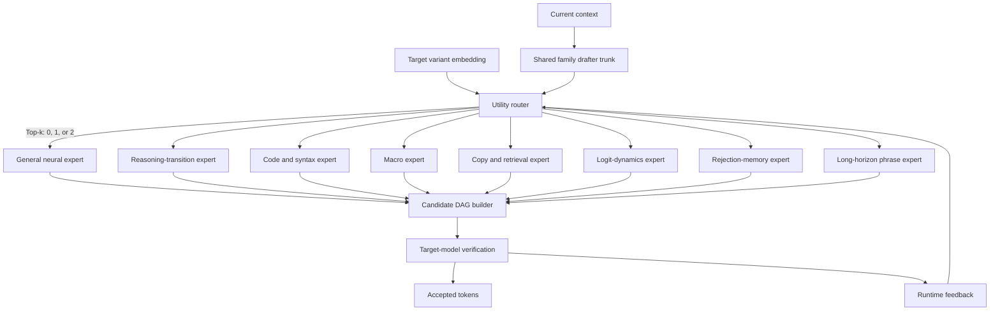

# FamilyDraftMoE: A Same-Family Mixture of Heterogeneous Speculative Drafters

**Research concept note**  
**Status:** Early architecture proposal  
**Novelty assessment date:** August 6, 2026

## Abstract

Speculative decoding normally relies on one small draft model that attempts to approximate a much larger target model. This creates an awkward trade-off: a stronger drafter increases acceptance but also increases drafting latency, while a very small drafter is cheap but fails on many kinds of continuations.

This proposal treats drafting as a sparse mixture-of-experts problem. A single **family-specific drafter** contains multiple experts, each specialized in a different source of predictability: ordinary language continuation, structural macros, code syntax, copying and retrieval, target-logit dynamics, long predictable phrases, and online rejection memory. A router activates only a small subset—typically **two of eight experts**—and each selected expert independently proposes a continuation. Their shared prefixes and disagreements are merged into one compact candidate DAG for verification by the target model.

The system is trained and routed for **accepted tokens per unit of wall-clock cost**, rather than conventional next-token perplexity. It supports several target models within one family through shared vocabulary, shared family behavior, a target-variant embedding, and lightweight online calibration.

The broad idea of an MoE drafter is not novel: Jakiro already introduces decoupled MoE experts for diverse speculative candidates. Multi-drafter selection is also established. The potentially novel contribution is a **same-family heterogeneous Proposal-MoE** whose experts use different proposal mechanisms and output spaces, whose router chooses a variable number of experts and expert-specific horizons, and whose candidates are fused at the sequence level rather than averaged as hidden states.

---

## 1. Research thesis

A draft model does not need to be uniformly good at language modeling. It needs to identify stretches where some cheap mechanism can predict the target model accurately enough to save time.

Different continuations are predictable for different reasons:

- prose may be predictable from semantic context;
- code may be predictable from syntax;
- JSON may be predictable from grammar state;
- repeated text may be predictable through copying;
- a family may repeatedly exhibit recognizable logit trajectories;
- recurring draft failures may be repairable through online memory.

A single dense drafter must learn all of these behaviors in the same parameters. FamilyDraftMoE instead gives them separate experts and activates only the useful ones.

> **Central hypothesis:** Drafter capacity does not have to equal drafter cost. A sparse mixture can contain many specialized proposal mechanisms while executing only the two most useful experts for the current decoding state.

---

## 2. Scope

The initial system targets **one model family only**, for example Qwen.

Supported targets might include:

- small, medium, and large models from the family;
- instruct and reasoning variants;
- general and coding variants;
- dense and MoE targets, provided they share a compatible tokenizer and output interface.

The design does **not** initially attempt cross-family transfer. This removes several distracting problems:

- cross-tokenizer alignment;
- incompatible chat templates;
- large behavioral differences between families;
- vocabulary projection across unrelated token spaces.

A target-variant embedding conditions the drafter on the exact family member:

\[
z_m = \operatorname{Embed}(\text{target model ID})
\]

The common family trunk learns shared behavior, while the embedding and online state capture differences between individual targets.

---

## 3. Architecture



### 3.1 Shared trunk

The shared trunk should be much smaller than the target and cheap enough that routing overhead remains negligible. Candidate backbones include:

- a shallow Transformer;
- a small Mamba or recurrent state-space model;
- a reduced-width family-native decoder;
- an EAGLE-style feature drafter when target hidden states are available.

The trunk produces a shared state:

\[
h_t = \operatorname{Trunk}(x_{\leq t}, z_m)
\]

This state is consumed by the neural experts and the router. Non-neural experts may consume raw text, parser state, retrieval indexes, or target logits directly.

### 3.2 Sparse routing

The canonical configuration is **top-2-of-8**, but the number of activated experts should be dynamic:

\[
k_t \in \{0,1,2\}
\]

- **Top-0:** abstain and run the target normally.
- **Top-1:** one expert is clearly sufficient.
- **Top-2:** two experts provide complementary, worthwhile branches.

A fixed two-expert policy is a useful baseline, but it wastes computation when the second expert adds no unique candidate coverage.

### 3.3 Independent proposals, not hidden-state averaging

The selected experts should generate independent candidate sequences:

\[
c_{e_1}=y^{(e_1)}_{t+1:t+d_1}
\]

\[
c_{e_2}=y^{(e_2)}_{t+1:t+d_2}
\]

Their outputs are merged into a prefix trie or DAG:

```text
Expert A: return result\n}
Expert B: return result\n\n}

Merged candidate DAG:

return result\n
             ├── }
             └── \n}
```

This preserves agreement as a long shared prefix while paying only for the actual disagreement nodes.

A conventional MoE that averages two expert hidden states mostly behaves like a slightly larger dense drafter. Sequence-level proposal fusion is more directly aligned with speculative verification.

---

## 4. Eight proposed experts

## 4.1 General neural continuation expert

A compact autoregressive expert distilled from multiple target variants in the family. It handles normal prose and provides a fallback when no specialist dominates.

This expert should probably be shared or frequently active because every specialist otherwise has to relearn ordinary language generation.

## 4.2 Reasoning-transition expert

Specializes in the family’s common reasoning trajectories rather than a broad subject such as mathematics.

Examples include transitions such as:

- premise to intermediate deduction;
- substitution to simplification;
- observation to conclusion;
- counterexample to corrected claim;
- plan step to execution step.

The goal is to predict the next **reasoning move**, particularly in family variants with characteristic reasoning formats.

## 4.3 Code and syntax expert

Specializes in code generation and parser-constrained continuation:

- indentation;
- closing scopes;
- imports and signatures;
- repeated variable use;
- common statements;
- code-fence handling;
- syntax-specific delimiters.

It may consume lightweight language-server or parser state in addition to the shared trunk.

## 4.4 Macro expert

Predicts multi-token actions from a small macro vocabulary rather than arbitrary tokens.

Example actions:

```text
CLOSE_PAREN
CLOSE_BLOCK
NEWLINE_INDENT
CONTINUE_ENUMERATION
CLOSE_CODE_FENCE
COPY_IDENTIFIER
REPEAT_LINE_PREFIX
CLOSE_JSON_OBJECT
```

A renderer expands each macro into native family tokens. One macro decision may generate several speculative tokens at very low cost.

The macro vocabulary can contain:

1. universal structural actions;
2. family-specific formatting conventions;
3. language-specific code actions;
4. task-specific macros learned from accepted target outputs.

## 4.5 Copy and retrieval expert

Uses cheap non-neural or lightly neural retrieval from:

- the prompt;
- recent output;
- repeated templates;
- local suffix matches;
- normalized code or JSON patterns;
- a cache of previously accepted family outputs.

The expert returns a candidate plus metadata:

\[
(c, \text{source}, \text{match length}, \text{confidence})
\]

It should support copy-and-edit proposals, not just exact copying. Identifiers, numbers, or names can be represented as slots and filled from the current context.

## 4.6 Logit-dynamics expert

Consumes the target model’s recent top-\(k\) distributions and treats them as a time series.

At decoding step \(t\):

\[
L_t = \{(v_i, \ell_i, r_i)\}_{i=1}^{K}
\]

where \(v_i\) is a token, \(\ell_i\) its logit, and \(r_i\) its rank.

A tiny recurrent model predicts:

- likely future token candidates;
- rank persistence;
- entropy trends;
- whether a low-entropy structural run is beginning;
- likely draft horizon before uncertainty rises.

Because all targets are from one family, the expert can operate directly in the family vocabulary.

## 4.7 Rejection-memory expert

Every failed speculative verification produces useful supervision:

```text
context fingerprint
proposed continuation
first rejected position
target replacement
accepted suffix after replacement
```

The rejection-memory expert stores recurring corrections and either:

- generates its own repaired branch; or
- rewrites another expert’s candidate before verification.

Example:

```text
General expert repeatedly proposes:  "\n-"
Target repeatedly chooses:            "\n\n-"

Future candidate DAG:
"\n"
 ├── "-"
 └── "\n-"
```

This expert adapts online without updating the main drafter weights.

## 4.8 Long-horizon phrase expert

Specializes in low-frequency but high-reward opportunities where a long continuation is predictable:

- standard explanations;
- conventional disclaimers;
- repeated generated structures;
- boilerplate code;
- long prompt copies;
- recurring tool-call payloads;
- list or table completion.

It may activate less often than other experts but propose substantially longer sequences.

---

## 5. Router objective

The router should not simply predict which expert has the lowest next-token loss. It should estimate the **net wall-clock value** of activating each expert.

For expert \(e\):

\[
U(e\mid x_t)
=
\mathbb{E}[\text{time saved by accepted tokens}]
-
\mathbb{E}[\text{draft and verification overhead}]
\]

A practical proxy is:

\[
U(e\mid x_t)
=
\frac{\mathbb{E}[A_e]}{C^{\text{draft}}_e + C^{\text{verify}}_e}
\]

where \(A_e\) is the number of tokens expected to be uniquely accepted because expert \(e\) was activated.

For the second expert, optimize **marginal utility**:

\[
\Delta U(e_2\mid e_1,x_t)
=
U(\{e_1,e_2\}\mid x_t)-U(e_1\mid x_t)
\]

Activate the second expert only when it adds candidate coverage not already supplied by the first.

### Router outputs

The router should jointly predict:

1. which experts to activate;
2. whether to abstain;
3. draft horizon per expert;
4. branch budget per expert;
5. whether agreement should extend the horizon;
6. whether disagreement is valuable enough to retain both paths.

### Router features

#### Context features

- shared trunk state;
- recent tokens;
- parser or grammar state;
- code/prose/structured-data classification;
- repetition score;
- prompt-copy score;
- open brackets, quotes, and scopes.

#### Target features

- exact target-variant embedding;
- target size or active parameter tier;
- recent target top-\(k\) logits;
- target entropy and top-token margin;
- current decoding mode.

#### Online feedback

For every expert:

- exponential moving average of accepted length;
- first-rejection position;
- drafting latency;
- marginal verification nodes introduced;
- frequency of contributing the accepted branch;
- task-conditional performance;
- recent rejection patterns.

---

## 6. Candidate DAG construction

A top-2 drafter becomes useful only when candidate fusion is efficient.

### 6.1 Prefix merging

All candidates are tokenized in the family vocabulary and inserted into one trie. Shared prefixes are stored once.

### 6.2 Candidate scoring

Each node can carry:

- expert source;
- expert confidence;
- router probability;
- historical acceptance rate;
- marginal verification cost;
- support count from agreeing experts.

### 6.3 Agreement

If two experts produce the same continuation, agreement can be used to:

- increase confidence;
- extend the speculative horizon;
- reduce branching;
- prioritize that path during tree-budget allocation.

### 6.4 Disagreement

Disagreement is valuable only when both alternatives have meaningful acceptance probability. The tree builder should retain branches that maximize:

\[
\frac{P(\text{branch accepted})}{\text{marginal verification cost}}
\]

Random diversity is not useful. The target is **accepted diversity**.

---

## 7. Training strategy

## 7.1 Stage 1: same-family distillation

Collect logits, hidden states where available, and generated traces from several target variants in the same family.

Condition the drafter on target identity:

\[
q_\theta(y\mid x,z_m)
\]

This avoids forcing the drafter to average contradictory behaviors from different target variants.

## 7.2 Stage 2: expert specialization

A standard MoE language-model objective may produce weak or collapsed experts. Use a multiple-choice loss so at least one expert covers the target continuation:

\[
\mathcal{L}_{\text{MCL}}
=
\min_{e\in\mathcal{E}}
\operatorname{CE}(q_e,y_{\text{target}})
\]

A softened top-2 version can train the two best experts while preserving specialization.

Expert-specific auxiliary supervision should also be used:

- macros from parser-derived actions;
- copying spans from alignment traces;
- logit dynamics from target top-\(k\) sequences;
- rejection memory from speculative rollouts;
- code actions from AST transitions.

## 7.3 Stage 3: speculative rollout training

Run the actual draft-and-verify loop during training and record:

- accepted prefix length;
- first rejection;
- target correction;
- expert latency;
- tree size;
- marginal contribution of each branch.

Optimize expected accepted length:

\[
\mathcal{L}_{\text{accept}}
=-\mathbb{E}[\text{accepted prefix length}]
\]

but combine it with measured cost so a larger drafter cannot win merely by being more accurate.

## 7.4 Stage 4: marginal diversity

Train the second expert to add useful alternatives:

\[
D(e_1,e_2)
=
P(e_1\text{ or }e_2\text{ accepted})
-
\max(P(e_1\text{ accepted}),P(e_2\text{ accepted}))
\]

The router should choose pairs with high \(D\), not simply the two highest individual scores.

## 7.5 Stage 5: utility and abstention calibration

Train the router on measured net latency saved:

\[
\mathcal{L}_{\text{utility}}
=-(T_{\text{baseline}}-T_{\text{DraftMoE}})
\]

A separate calibration head predicts whether speculation will produce positive speedup. When it predicts negative utility, the system abstains.

---

## 8. Novelty assessment

### 8.1 What is not novel

The following claims should not be made:

- “the first MoE speculative drafter”;
- “the first top-2-of-8 drafter”;
- “the first system to use multiple speculative drafters”;
- “the first system to route between draft models.”

**Jakiro** introduces decoupled MoE experts into a draft model to generate diverse candidates from distinct feature spaces. This directly occupies the broad MoE-drafter claim.

**MetaSD** dynamically allocates computation among heterogeneous drafters using alignment feedback.

**Not-a-Bandit** studies online selection among specialized drafters with full-information feedback and no-regret guarantees.

**SpecForge** evaluates conventional MoE draft architectures and reports that dense drafters outperform the tested MoE variants; top-1 routing exposes each expert to fewer training tokens, while increasing top-\(k\) raises drafting cost.

### 8.2 Potentially novel contribution

The defensible contribution is narrower:

> **A same-family heterogeneous Proposal-MoE drafter in which neural, structural, retrieval, logit-dynamic, macro, and online correction experts independently propose candidate sequences. A latency-aware router dynamically selects zero, one, or two experts, assigns expert-specific horizons and node budgets, and fuses their proposals into a shared verification DAG.**

Likely differentiators:

1. **Heterogeneous proposal mechanisms**, rather than interchangeable neural FFNs.
2. **Independent sequence proposals**, rather than hidden-state mixing.
3. **Variable top-\(k\)** with an explicit abstention option.
4. **Candidate-level DAG fusion** across experts.
5. **Expert-specific draft horizons** and branch budgets.
6. **Marginal-utility routing** for the second expert.
7. **Online rejection memory as a first-class expert.**
8. **Macro actions that emit multi-token native-family continuations.**
9. **Same-family multi-target training** with target-variant conditioning.
10. **Direct optimization of accepted tokens per wall-clock cost.**

### 8.3 Novelty risk

This remains a high-risk novelty claim because the components are individually adjacent to existing work. A deeper literature and patent search is required before submission. The research should be positioned around the **heterogeneous proposal interface and utility-aware fusion mechanism**, not around the phrase “MoE drafter.”

---

## 9. Key research questions

1. Does heterogeneous specialization outperform a dense drafter at equal active FLOPs?
2. Does the second expert add enough unique accepted branches to justify its cost?
3. Which expert pairs have the highest marginal value?
4. Does candidate-DAG fusion outperform selecting one complete drafter per step?
5. Can rejection memory improve online without destabilizing exact verification?
6. Does one family-level drafter transfer to unseen target sizes or variants within that family?
7. Does utility-based routing outperform acceptance-probability routing?
8. Can macro actions materially increase accepted length on structured generation?
9. How quickly does the router adapt to a new target variant?
10. Does the MoE system improve end-to-end throughput, not merely acceptance length?

---

## 10. Experimental plan

## 10.1 Initial family

Use one family with several accessible checkpoints and a shared tokenizer. Qwen is a practical candidate.

Example targets:

- a small instruct target;
- a medium instruct target;
- a large or MoE target;
- a coder variant;
- a reasoning variant.

## 10.2 Minimal prototype

Start with four experts:

1. general neural expert;
2. macro/code expert;
3. copy/retrieval expert;
4. rejection-memory expert.

Use:

- top-0/1/2 routing;
- maximum draft horizon of eight tokens;
- maximum candidate DAG size of 16–32 nodes;
- greedy decoding first;
- family-native tokenization;
- online acceptance statistics.

Add logit dynamics only after the basic router and DAG builder work.

## 10.3 Baselines

Compare against:

1. autoregressive target decoding;
2. one small dense autoregressive drafter;
3. an equal-active-FLOP dense drafter;
4. a conventional neural 8-expert top-2 MoE drafter;
5. a Jakiro-style decoupled neural-expert drafter;
6. single-best heterogeneous expert selection;
7. heterogeneous top-2 without candidate fusion;
8. full heterogeneous Proposal-MoE;
9. full system without rejection memory;
10. full system without abstention.

## 10.4 Ablations

- fixed top-1 vs fixed top-2 vs variable top-\(k\);
- hidden-state mixing vs independent proposal branches;
- expert-level selection vs candidate-level fusion;
- acceptance-based routing vs latency-utility routing;
- shared draft horizon vs expert-specific horizons;
- no target embedding vs target-variant embedding;
- no online feedback vs online calibration;
- exact retrieval vs normalized structural retrieval;
- macro expert with and without parser state;
- rejection memory as repair-only vs independent branch expert.

## 10.5 Metrics

Primary metric:

\[
\text{End-to-end target tokens per second}
\]

Supporting metrics:

- accepted tokens per verification pass;
- mean accepted prefix length;
- drafter latency;
- target verification latency;
- candidate DAG node count;
- marginal accepted tokens from the second expert;
- expert utilization and load balance;
- abstention precision;
- online adaptation speed;
- memory overhead;
- speedup by task type;
- transfer to unseen family variants.

A useful expert-efficiency metric is:

\[
\text{Proposal utility}
=
\frac{\text{uniquely accepted tokens}}
{\text{drafter latency}+\text{marginal verification latency}}
\]

---

## 11. Expected failure modes

### 11.1 The second expert adds redundant candidates

Two experts may generate nearly identical continuations, increasing cost without improving coverage.

**Mitigation:** train and route on marginal accepted utility; merge common prefixes aggressively.

### 11.2 Expert starvation

Sparse experts see fewer examples and become weaker than an equal-FLOP dense model.

**Mitigation:** shared general expert, balanced auxiliary datasets, softened top-2 training, expert pretraining, and periodic forced routing.

### 11.3 Router overhead erases gains

A complex neural router or running several experts serially may eliminate speculative speedup.

**Mitigation:** shallow router, parallel expert execution, top-1 when possible, strict cost-aware abstention.

### 11.4 Macro errors create long failed branches

A wrong macro can produce many rejected tokens.

**Mitigation:** parser validation, conservative confidence thresholds, short fallback branch, and macro-specific utility penalties.

### 11.5 Rejection-memory overfits transient behavior

One-off corrections may pollute the memory.

**Mitigation:** decayed counts, minimum support, target-variant scoping, bounded cache, and uncertainty-aware retrieval.

### 11.6 Family variants disagree strongly

A coder and reasoning model may exhibit conflicting continuation preferences.

**Mitigation:** exact target embedding, target-specific online calibration, and small target adapters if necessary.

### 11.7 High acceptance but worse throughput

A powerful MoE drafter may increase acceptance while costing too much.

**Mitigation:** report wall-clock throughput as the primary result and train the router on latency utility.

---

## 12. Strongest paper framing

### Weak framing

> We apply a mixture-of-experts architecture to speculative decoding.

This overlaps directly with existing work.

### Stronger framing

> Existing MoE drafters scale neural capacity but treat experts as interchangeable predictors. We instead model speculative drafting as a mixture of heterogeneous proposal mechanisms. Each expert captures a distinct reason a continuation may be predictable, and the router optimizes the marginal wall-clock value of activating it. Independent expert proposals are fused into one verification DAG, allowing agreement to extend drafts and disagreement to provide low-cost candidate diversity.

### Proposed contribution statement

> We introduce **FamilyDraftMoE**, a same-family heterogeneous Proposal-MoE for speculative decoding. FamilyDraftMoE combines neural continuation, reasoning transition, code, macro, retrieval, logit-dynamic, rejection-memory, and long-horizon experts. A utility-calibrated router dynamically activates zero, one, or two experts and assigns expert-specific draft horizons. Their independent proposals are merged into a compact candidate DAG and exactly verified by the target model. The system is trained to maximize accepted tokens per unit of end-to-end latency rather than conventional language-model likelihood.

---

## 13. Suggested project phases

### Phase 1: prove the routing thesis

- one family;
- four experts;
- greedy decoding;
- fixed top-2 and variable top-\(k\);
- candidate DAG fusion;
- latency instrumentation.

Success criterion: heterogeneous top-2 beats an equal-active-FLOP dense drafter in end-to-end throughput on at least two materially different task classes.

### Phase 2: improve specialization

- add reasoning and logit-dynamics experts;
- introduce multiple-choice training;
- optimize marginal diversity;
- add target-variant embeddings;
- test transfer to unseen family variants.

### Phase 3: online adaptation

- rejection memory;
- per-expert acceptance calibration;
- dynamic draft horizons;
- abstention;
- session-level adaptation.

### Phase 4: production evaluation

- continuous batching;
- high batch sizes;
- GPU kernel profiling;
- candidate-tree verification overhead;
- MoE target verification cost where relevant;
- long-context and agent workloads.

---

## 14. Working names

- **FamilyDraftMoE**
- **ProposalMoE**
- **MoDE: Mixture of Drafting Experts**
- **SpecMix**
- **DraftRouter**
- **HydraDraft**
- **HeteroDraft**

**Best descriptive name:** FamilyDraftMoE  
**Best paper-style name:** MoDE: Mixture of Drafting Experts

---

## 15. References

1. Huang, H., Yang, F., Liu, Z., & Ren, P. **Jakiro: Boosting Speculative Decoding via Decoupled MoE.** ACL 2026.  
   https://aclanthology.org/2026.acl-long.487/

2. Li, S. et al. **SpecForge: A Flexible and Efficient Open-Source Training Framework for Speculative Decoding.** arXiv:2603.18567, 2026.  
   https://arxiv.org/abs/2603.18567

3. Kim, T., Jung, H., & Yun, S.-Y. **Multi-Drafter Speculative Decoding with Alignment Feedback.** arXiv:2604.05417, 2026.  
   https://arxiv.org/abs/2604.05417

4. Liu, H., Huang, J., Jia, Z., Park, Y., & Wang, Y.-X. **Not-a-Bandit: Provably No-Regret Drafter Selection in Speculative Decoding for LLMs.** arXiv:2510.20064.  
   https://arxiv.org/abs/2510.20064

---

## 16. Bottom line

A generic “MoE drafter” or “two-of-eight drafter” is already covered by prior work. The research opportunity is a narrower and more system-oriented architecture:

> **One same-family drafter containing heterogeneous proposal experts, with variable sparse activation, sequence-level candidate fusion, online rejection memory, structural macros, and routing based on marginal accepted tokens per unit of latency.**

That version is coherent, testable, and plausibly novel enough to justify a serious prototype and deeper literature review.
